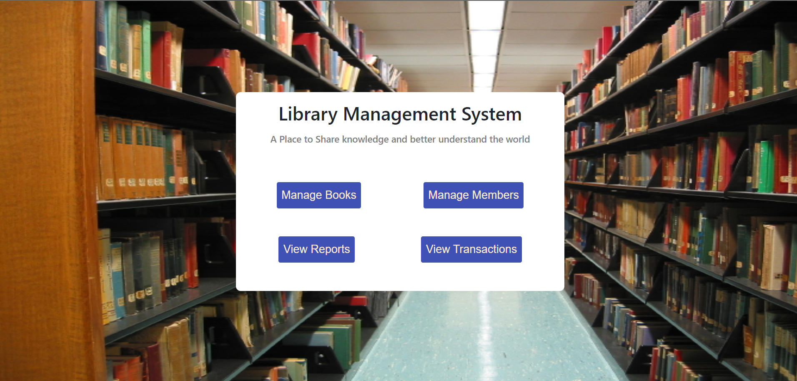
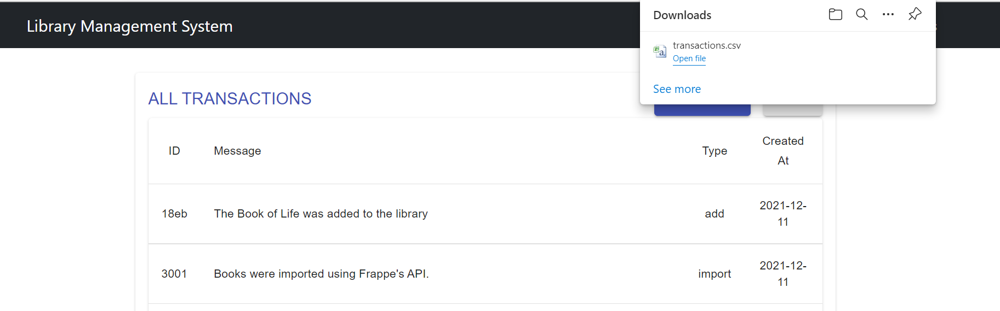
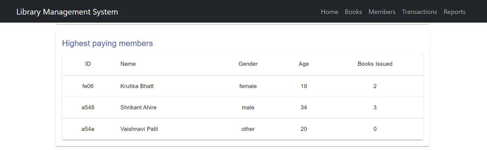

# Library Management System

### View the project deployed on heroku [here](https://library-management-system-2.herokuapp.com/)<br>
 
<br>
This project was built as part of <a href="https://frappe.io/dev-hiring-test">Frappe's Dev Hiring Test</a> .This is a Library Management System which supports:
- Basic CRUD operations on Books and Members.
- Issue a set of books to a member
- Returning set of books from a member
- Charging rent of the book taken
- Ensuring the debt does not go above Rs. 500.

Additionally, a librarian is able to maintain:
- Books
- Members
- Transactions
- Reports on popular books and highest paying members

Some Additional Features from my side😎
- Downloading a csv file for the transactions along with the date 
- Report can be viewed in a pi-chart [Using Google-react-chart]
- Deployment of both backend and frontend on heroku


## Run the Application in your machine:

- Install the React dependencies:

```
npm install
```
- Start the server:
```
npm start
```
- Open `localhost:3000` in your browser.


- Install the Backend dependencies:

```
cd main_routes
npm install
```
- Start the server:
```
npm start
```
- Backend runs on localhost:8080
- The backend can be viewed [here](https://frappebackend.herokuapp.com/books)

## Screenshots
1. Homescreen


2. Manage Books


3. Edit Book


4. View a book


5. Manage Members


6. Add Member


7. Issue a Book


8. In case of Debt Exceeding


10. Return Books


10. Transaction


11. Report [With Graphs]




